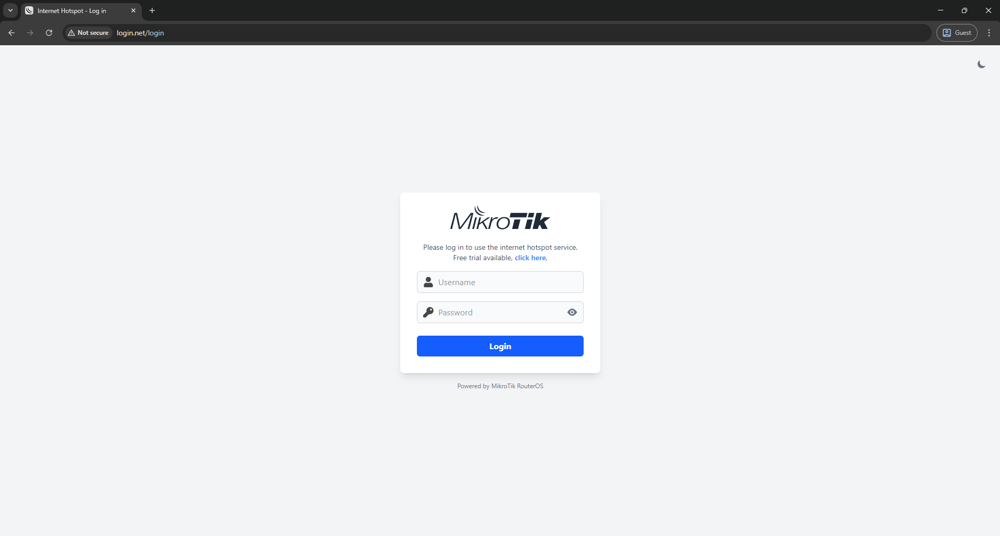

# MikroTik Hotspot Pages - Custom Home

Sebuah templat halaman hotspot MikroTik yang modern, minimalis, dan responsif, dibangun dari awal menggunakan **Tailwind CSS**.

Template ini dirancang untuk menggantikan halaman hotspot default MikroTik dengan tampilan yang lebih bersih, lebih ringan, dan lebih ramah pengguna, terutama untuk perangkat mobile.

## ✨ Tampilan (Preview)

<p align="center">
  
  &nbsp;&nbsp;
  
</p>
<p align="center">
  
  &nbsp;&nbsp;
  
</p>

## 🚀 Fitur Utama

- **Desain Modern & Minimalis**: Tampilan bersih dan terpusat (single card) untuk semua halaman (`login`, `status`, `logout`, `error`, `alogin`, `radvert`).
- **Dibangun dengan Tailwind CSS v4**: Kustomisasi yang sangat mudah dan ukuran file CSS yang sangat kecil berkat proses optimasi.
- **Mode Gelap & Terang (Dark/Light Mode)**: Pengguna bisa memilih tema favoritnya, dan pilihan akan disimpan di browser untuk kunjungan berikutnya.
- **Multi-Bahasa (English/Indonesia)**: Toggle bahasa dengan tombol EN/ID di pojok kanan atas. Pilihan bahasa disimpan di localStorage.
- **Sticky Navbar**: Tombol toggle tema dan bahasa berada di navbar sticky yang tidak overlap dengan konten di mobile.
- **Terjemahan Error Messages**: Pesan error dari MikroTik otomatis diterjemahkan sesuai bahasa yang dipilih.
- **Session Cookie Control**: Opsi "Log out & Clear" untuk menghapus session cookie saat logout (fresh login berikutnya).
- **Default Mode Gelap**: Secara otomatis menampilkan tema gelap untuk pengunjung baru untuk kenyamanan mata.
- **Tampilkan/Sembunyikan Password**: Memudahkan pengguna saat mengetik password di perangkat mobile.
- **Responsif**: Tampilan optimal di perangkat desktop maupun mobile.
- **Heroicons**: Menggunakan icon dari [Heroicons](https://heroicons.com/) - library icon official dari tim Tailwind CSS.
- **Ringan & Cepat**: Tidak menggunakan jQuery atau framework JavaScript berat lainnya, hanya Vanilla JavaScript murni.
- **Kompatibilitas Penuh**: Tetap mempertahankan semua variabel dan logika asli dari MikroTik Hotspot.

## 📁 Struktur Halaman

| File | Deskripsi |
|------|-----------|
| `login.html` | Halaman login dengan form username/password |
| `status.html` | Status koneksi dengan tombol Log out, Log out & Clear, dan Continue |
| `logout.html` | Konfirmasi logout dengan tombol Log in |
| `error.html` | Halaman error dengan pesan yang diterjemahkan |
| `alogin.html` | Halaman sukses login (redirect) |
| `radvert.html` | Halaman advertisement |

## 🌐 Fitur Multi-Bahasa

Template ini mendukung dua bahasa:
- **English** (default)
- **Bahasa Indonesia**

Pengguna dapat mengganti bahasa dengan menekan tombol **EN/ID** di pojok kanan atas (sebelah tombol dark mode).

### Teks yang Diterjemahkan:
- Label form (Username, Password)
- Tombol (Login, Logout, Continue, dll)
- Pesan status dan informasi
- **Error messages dari MikroTik** (seperti "invalid username or password" → "nama pengguna atau kata sandi salah")

## 🛠️ Teknologi yang Digunakan

- [Tailwind CSS v4](https://tailwindcss.com/) - Utility-first CSS framework
- [Heroicons](https://heroicons.com/) - Beautiful hand-crafted SVG icons
- Vanilla JavaScript - Untuk fungsionalitas interaktif (toggle tema, bahasa, dan password)

## ⚙️ Cara Penggunaan (Instalasi)

1.  Unduh rilis terbaru atau _clone_ repositori ini.
2.  Buka WinBox, lalu klik menu **Files**.
3.  _Drag and drop_ seluruh isi folder `hotspot` dari proyek ini ke dalam File List di MikroTik Anda. Jika sudah ada folder `hotspot`, timpa saja isinya.
4.  Buka **IP** -> **Hotspot** -> tab **Server Profiles**.
5.  Pilih profil server Anda, dan di kolom **HTML Directory**, pastikan namanya adalah `hotspot`.

## 🎨 Kustomisasi & Pengembangan (Development)

Proyek ini menggunakan **Tailwind CSS v4**, yang memerlukan proses _build_ untuk menghasilkan file `style.css` final setiap kali ada perubahan pada _class_ HTML.

**Langkah-langkah untuk kustomisasi:**

1.  Pastikan Anda memiliki [Node.js](https://nodejs.org/) terinstal di komputer Anda.
2.  Buka terminal di folder proyek dan jalankan:
    ```bash
    npm install tailwindcss @tailwindcss/cli
    ```
3.  Lakukan perubahan pada file-file HTML di dalam folder `hotspot` (misalnya, mengubah teks, warna, atau tata letak dengan _class_ Tailwind).
4.  Untuk menambah/mengedit terjemahan, edit file `hotspot/js/app.js` pada object `translations`.
5.  Setelah selesai melakukan perubahan, jalankan perintah _build_ di terminal:
    ```bash
    npx @tailwindcss/cli -i ./src/input.css -o ./hotspot/css/style.css --minify
    ```
6.  Setelah proses _build_ selesai, unggah kembali folder `hotspot` yang sudah diperbarui ke MikroTik Anda.

## 📝 Menambah Terjemahan Baru

Untuk menambah atau mengedit terjemahan, buka file `hotspot/js/app.js` dan edit object `translations`:

```javascript
const translations = {
  en: {
    'login_btn': 'Connect',
    'logout_btn': 'Log out',
    'logout_clear_btn': 'Log out & Clear',
    // ... tambahkan key baru di sini
  },
  id: {
    'login_btn': 'Sambungkan',
    'logout_btn': 'Keluar',
    'logout_clear_btn': 'Keluar & Hapus Sesi',
    // ... tambahkan terjemahan di sini
  }
};
```

Kemudian di HTML, gunakan atribut `data-i18n`:
```html
<button data-i18n="login_btn">Login</button>
```

## 🙏 Credits

- Desain dikembangkan dari awal tetapi terinspirasi dari templat hotspot default MikroTik.
- Template asli referensi: [ihsanularifinm/MikroTik-Hotspot-Pages-Default](https://github.com/ihsanularifinm/MikroTik-Hotspot-Pages-Default)
- Icons: [Heroicons](https://heroicons.com/) by Tailwind CSS team
