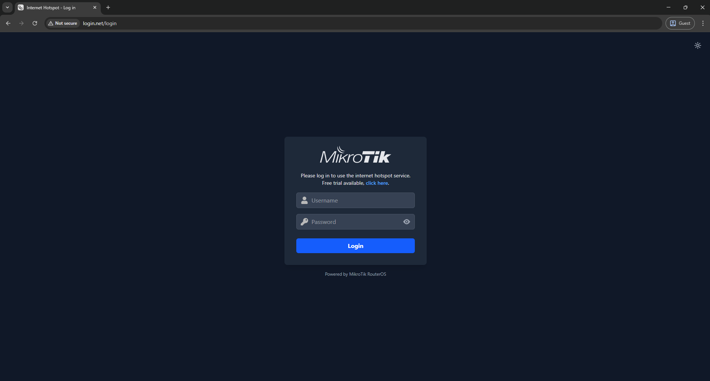

# MikroTik Hotspot Pages - Custom Home

Sebuah templat halaman hotspot MikroTik yang modern, minimalis, dan responsif, dibangun dari awal menggunakan **Tailwind CSS**.

Template ini dirancang untuk menggantikan halaman hotspot default MikroTik dengan tampilan yang lebih bersih, lebih ringan, dan lebih ramah pengguna, terutama untuk perangkat mobile.

## ✨ Tampilan (Preview)

<p align="center">
  
  &nbsp;&nbsp;
  
</p>

## 🚀 Fitur Utama

- **Desain Modern & Minimalis**: Tampilan bersih dan terpusat (single card) untuk semua halaman (`login`, `status`, `logout`, `error`).
- **Dibangun dengan Tailwind CSS**: Kustomisasi yang sangat mudah dan ukuran file CSS yang sangat kecil berkat proses optimasi.
- **Mode Gelap & Terang (Dark/Light Mode)**: Pengguna bisa memilih tema favoritnya, dan pilihan akan disimpan di browser untuk kunjungan berikutnya.
- **Default Mode Gelap**: Secara otomatis menampilkan tema gelap untuk pengunjung baru untuk kenyamanan mata.
- **Tampilkan/Sembunyikan Password**: Memudahkan pengguna saat mengetik password di perangkat mobile.
- **Responsif**: Tampilan optimal di perangkat desktop maupun mobile.
- **Ringan & Cepat**: Tidak menggunakan jQuery atau framework JavaScript berat lainnya, hanya Vanilla JavaScript murni.
- **Kompatibilitas Penuh**: Tetap mempertahankan semua variabel dan logika asli dari MikroTik Hotspot.

## 🛠️ Teknologi yang Digunakan

- [Tailwind CSS](https://tailwindcss.com/) - Utility-first CSS framework.
- Vanilla JavaScript - Untuk fungsionalitas interaktif seperti _toggle_ tema dan password.

## ⚙️ Cara Penggunaan (Instalasi)

1.  Unduh rilis terbaru atau _clone_ repositori ini.
2.  Buka WinBox, lalu klik menu **Files**.
3.  _Drag and drop_ seluruh isi folder `hotspot` dari proyek ini ke dalam File List di MikroTik Anda. Jika sudah ada folder `hotspot`, timpa saja isinya.
4.  Buka **IP** -> **Hotspot** -> tab **Server Profiles**.
5.  Pilih profil server Anda, dan di kolom **HTML Directory**, pastikan namanya adalah `hotspot`.

## 🎨 Kustomisasi & Pengembangan (Development)

Proyek ini menggunakan **Tailwind CSS**, yang memerlukan proses _build_ untuk menghasilkan file `style.css` final setiap kali ada perubahan pada _class_ HTML.

**Langkah-langkah untuk kustomisasi:**

1.  Pastikan Anda memiliki [Node.js](https://nodejs.org/) terinstal di komputer Anda.
2.  Buka terminal di folder proyek dan jalankan `npm install tailwindcss @tailwindcss/cli` untuk menginstal dependensi (Tailwind CSS).
3.  Lakukan perubahan pada file-file HTML di dalam folder `hotspot` (misalnya, mengubah teks, warna, atau tata letak dengan _class_ Tailwind).
4.  Setelah selesai melakukan perubahan, jalankan perintah _build_ di terminal untuk mengkompilasi file `style.css` yang baru:
    ```bash
    npx @tailwindcss/cli -i ./src/input.css -o ./hotspot/css/style.css --minify
    ```
5.  Setelah proses _build_ selesai, unggah kembali folder `hotspot` yang sudah diperbarui ke MikroTik Anda.

## 🙏 Credits

Desain ini dikembangkan dari awal tetapi terinspirasi dari templat hotspot default MikroTik. Template asli yang menjadi referensi awal dapat ditemukan di repositori [ihsanularifinm/MikroTik-Hotspot-Pages-Default](https://github.com/ihsanularifinm/MikroTik-Hotspot-Pages-Default).
